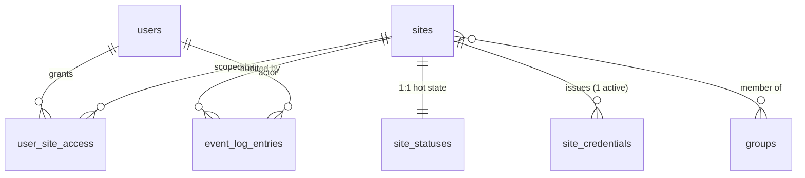
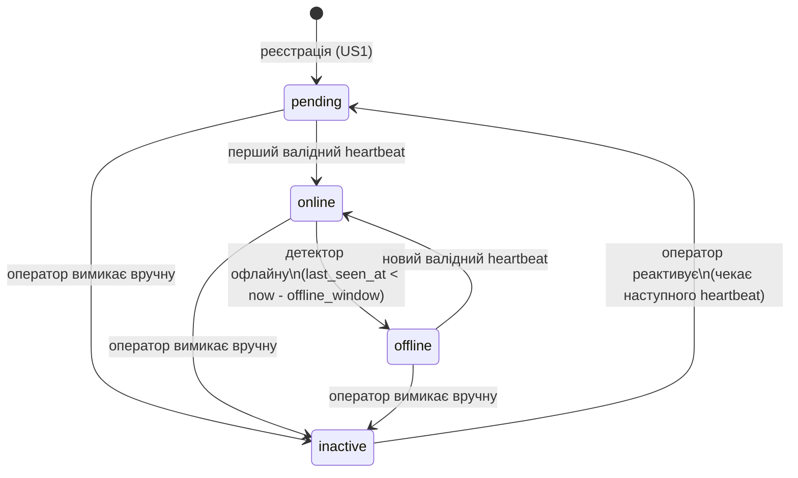
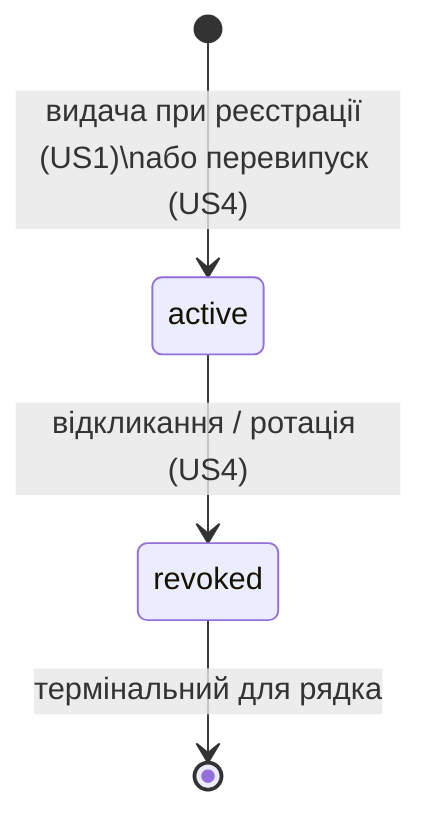

# Модель даних: Реєстрація сайтів та моніторинг статусу підключення

**Feature**: `001-site-connectivity-failover` | **Phase**: 1 (Design) | **Date**: 2026-07-21

**Storage engine**: PostgreSQL 16+ (CRM-бекенд). Ефемерний стан (nonce-store, rate-limit buckets, queue) — Redis. Плагін тримає свій бік у WordPress Options API (поза цією схемою).

---

## Огляд і конвенції

- Усі first-class сутності живуть у PostgreSQL; часи — `TIMESTAMPTZ` (UTC).
- Первинні ключі — `BIGINT GENERATED ALWAYS AS IDENTITY` (internal surrogate), окремо від публічних непрозорих ідентифікаторів.
- Enum-типи реалізуються як PostgreSQL `CHECK`-констрейнти або native `ENUM` (суворі типи — вимога моделі довіри конституції).
- `Heartbeat` і `Proxy/Ingress` — **не** persisted-таблиці; описані окремо (transient / infrastructure).
- Патерн зберігання статусу — **latest-wins**: кожен heartbeat НЕ архівується; зберігається лише поточний стан + обмежений журнал **змін** статусу (транзицій).

### ER-огляд (persisted-сутності)

---

## 1. Site (`sites`)

Зареєстрований сайт мережі. Тримає **стабільні реєстраційні дані** та стабільний публічний ідентифікатор. «Гарячі» write-колонки статусу винесені в `site_statuses` (1:1), щоб рутинні heartbeat-апдейти не роздували індекси реєстраційних даних (research: heartbeat storage model).

| Поле | Тип | Констрейнти / примітки |
|------|-----|------------------------|
| `id` | `BIGINT` identity | PK (internal surrogate). |
| `name` | `VARCHAR(255)` | `NOT NULL`. Назва сайту (FR-001). |
| `domain` | `VARCHAR(255)` | `NOT NULL`, `UNIQUE` (нормалізований lowercase, без схеми/слеша). Забороняє дубль домену (FR-006). |
| `site_identifier` | `VARCHAR(64)` | `NOT NULL`, `UNIQUE`. **Публічний, несекретний** непрозорий high-entropy ідентифікатор (FR-002). Стабільний: ротація секрету його **не** змінює (A-4). Використовується проксі й бекендом для пошуку сайту. |
| `active_credential_id` | `BIGINT` | `NULL`, FK → `site_credentials.id` (`ON DELETE SET NULL`). Швидке посилання на поточний активний секрет (spec: «посилання на активний токен»). |
| `deactivated_at` | `TIMESTAMPTZ` | `NULL`. Заповнене ⇒ сайт вимкнено вручну (латч `inactive`). |
| `created_at` | `TIMESTAMPTZ` | `NOT NULL`. |
| `updated_at` | `TIMESTAMPTZ` | `NOT NULL`. |

**Uniqueness / identity**
- `domain` глобально унікальний (FR-006) — нормалізується перед вставкою.
- `site_identifier` глобально унікальний і **незмінний** протягом життя сайту.
- Внутрішній `id` ніколи не розкривається плагінам/у відповідях (FR-019/FR-032).

**Relationships**
- `1:1` → `site_statuses` (поточний стан).
- `1:N` → `site_credentials` (історія секретів; рівно один `active` за замовчуванням).
- `M:N` → `groups` через `site_group`.
- `1:N` → `event_log_entries`.

**Design mapping**: `design/docs/data-model.md` → `Site` (`id, name, domain, status, groups, token`). Поле `token` дизайну тут декомпозоване на `site_identifier` (публічний) + `site_credentials` (секрет). `status`/`sync`/`favorite`/`subs` дизайну — поза межами цієї фічі (A-1, A-6).

---

## 2. SiteStatus (`site_statuses`) — 1:1 гарячий стан

Поточний (latest-wins) статус підключення. Оновлюється ідемпотентним upsert-ом воркера heartbeat та set-based UPDATE-детектором офлайну.

| Поле | Тип | Констрейнти / примітки |
|------|-----|------------------------|
| `site_id` | `BIGINT` | PK **та** FK → `sites.id` (`ON DELETE CASCADE`). 1:1. |
| `status` | enum | `NOT NULL`, `CHECK (status IN ('pending','online','offline','inactive'))`. Відображуваний статус (FR-013). Значення `reserve` (бурштин) **не** застосовується до сайтів — це стан номера (A-3). |
| `last_seen_at` | `TIMESTAMPTZ` | `NULL` до першого валідного звіту. Час останнього **прийнятого** heartbeat (FR-012). База для детекції офлайну (FR-014). |
| `last_status_change_at` | `TIMESTAMPTZ` | `NOT NULL`. Момент останньої транзиції статусу (джерело «часу останнього оновлення» в UI, A-7; точка емісії аудит-події). |
| `updated_at` | `TIMESTAMPTZ` | `NOT NULL`. Оновлюється кожним upsert-ом. |

**Індекси**
- PK `(site_id)`.
- Частковий індекс детектора офлайну: `(last_seen_at) WHERE status = 'online'` — робить sweep і фільтр списку дешевими (research: offline detection).
- Індекс `(status)` для фільтра «N із M» (FR-018).

**State machine (`status`)**

Правила транзицій:
- `pending` — початковий стан одразу після реєстрації, поки плагін не звітував (FR-013, US1 сценарій 3).
- `pending/offline → online` та `online → offline` — **автоматичні**, керуються потоком heartbeat (push-based; CRM не пінгує — FR-014).
- `offline` виставляється командою `sites:detect-offline` (щохвилини, `withoutOverlapping`): один set-based UPDATE усіх `status='online' AND last_seen_at < now() - offline_window` (дефолт ≈ 5 хв / 3 пропущені звіти, конфігуровано — A-2, SC-003).
- `inactive` — **ручний латч** (вимкнено оператором). Поки активний, автоматичні heartbeat-транзиції придушені; повернення в потік — лише через явну реактивацію (`inactive → pending`).
- Кожна транзиція емітує подію → `event_log_entries` (FR-021, changelog).

**Легенда кольорів (UI, FR-016)**: `online`→зелений (активний), `pending`→синій, `offline`→червоний (помилка), `inactive`→сірий (неактивний).

---

## 3. Groups (`groups`, `site_group`)

Групування сайтів для фільтрації списку (дизайн-бриф §1). Мінімально необхідне в цій фічі; повна механіка груп — суміжна.

**`groups`**

| Поле | Тип | Констрейнти |
|------|-----|-------------|
| `id` | `BIGINT` identity | PK. |
| `name` | `VARCHAR(120)` | `NOT NULL`, `UNIQUE`. |
| `created_at` | `TIMESTAMPTZ` | `NOT NULL`. |

**`site_group`** (pivot M:N)

| Поле | Тип | Констрейнти |
|------|-----|-------------|
| `site_id` | `BIGINT` | FK → `sites.id` (`ON DELETE CASCADE`). |
| `group_id` | `BIGINT` | FK → `groups.id` (`ON DELETE CASCADE`). |
| — | — | PK `(site_id, group_id)`. |

**Design mapping**: `design/docs/data-model.md` → `Group` (`name` унікальна, членство через `site.groups`). Сайт може входити в кілька груп.

---

## 4. SiteCredential (`site_credentials`)

Секретний per-site ключ підпису (HMAC-секрет) з життєвим циклом `active`/`revoked`. Публічний ідентифікатор тут **не** зберігається — він стабільний і живе на `sites.site_identifier`, бо ротація секрету його не змінює (A-4). Концептуально спека об'єднує «id + секрет» в одну сутність «Token / Site Credentials»; ми нормалізуємо стабільний id на `sites`, а рядки цієї таблиці представляють секрет, що ротується.

| Поле | Тип | Констрейнти / примітки |
|------|-----|------------------------|
| `id` | `BIGINT` identity | PK. |
| `site_id` | `BIGINT` | `NOT NULL`, FK → `sites.id` (`ON DELETE CASCADE`). |
| `secret_encrypted` | `TEXT` | `NOT NULL`. **Секрет 256-bit CSPRNG, зашифрований at-rest** (Laravel encrypter / envelope-KMS; ключ у env/secret-store, не в репозиторії). Показується оператору **один раз** при видачі (FR-004), далі у відкриту недоступний. |
| `sig_version` | `VARCHAR(8)` | `NOT NULL DEFAULT 'v1'`. Версія схеми підпису (crypto-agility). |
| `state` | enum | `NOT NULL`, `CHECK (state IN ('active','revoked'))`. |
| `issued_at` | `TIMESTAMPTZ` | `NOT NULL`. Час видачі. |
| `revoked_at` | `TIMESTAMPTZ` | `NULL` доки `active`. |
| `last_used_at` | `TIMESTAMPTZ` | `NULL`. Оновлюється тим самим upsert-ом heartbeat (FR: час останнього використання секрету). |
| `created_at` / `updated_at` | `TIMESTAMPTZ` | `NOT NULL`. |

> **ВАЖЛИВА примітка про зберігання (розбіжність із формулюванням).** Задача/конституція подекуди кажуть «hashed на боці CRM». Для **HMAC-верифікації** односторонній хеш (bcrypt тощо) **неможливий** — бекенд ОБОВ'ЯЗКОВО потребує оригінал секрету, щоб перерахувати підпис (research: proxy → secret storage). Тому коректно — **зворотно-шифроване зберігання at-rest**, а не password-hash. Формулювання «неможливо прочитати у відкриту» (FR-004) задовольняється шифруванням із ключем поза БД. Це узгодити в plan.md (open_note #1).

**Uniqueness / identity**
- **Один активний секрет на сайт**: частковий унікальний індекс `UNIQUE (site_id) WHERE state = 'active'`. (Опційне вікно перекриття двох секретів на час ротації, якщо приймається — тоді констрейнт послаблюється до перевірки в застосунку; за замовчуванням суворо один active.)
- Порівняння підпису на бекенді — constant-time (`hash_equals`), поза схемою.

**State machine (`state`)**

Правила:
- **Видача** (реєстрація або перевипуск): створюється новий рядок `active`; `sites.active_credential_id` вказує на нього.
- **Відкликання** (FR-005): `state → revoked`, `revoked_at = now()`; набуває чинності майже одразу — бекенд відхиляє наступні запити зі старим секретом (SC-006). `revoked` — термінальний (immutable рядок), реюзу немає.
- **Ротація** = revoke поточного `active` + видача нового `active`. **`sites.site_identifier` НЕ змінюється** (A-4). Секрет показується один раз (US4 сценарій 2).
- Джерело істини стану токена — виключно бекенд (FR-029); проксі його не тримає.

**Design mapping**: декомпозиція `Site.token` (`design/docs/data-model.md`) + вкладки «Подключение»/«Токени та синхронізація» дизайну (§9).

---

## 5. StatusReport / Heartbeat — *transient, НЕ persisted*

Повідомлення плагіна про статус підключення. **Не** зберігається порядково (500 сайтів × 1/хв ≈ 720k рядків/добу без потреби — research). Приймається контролером, ставиться в чергу як `ProcessHeartbeat` job, обробляється асинхронно (FR-010, Принцип IV), матеріалізується як latest-wins у `site_statuses`.

**Тіло запиту (JSON, підписується)**

| Поле | Тип | Примітки |
|------|-----|----------|
| `site_id` | string | = публічний `site_identifier` (пошук сайту, несекретний). |
| `status` | string | Лише `"online"` у цій фічі (плагін звітує лише коли живий; `offline` виводить CRM за тишею — FR-013/FR-014). |
| `timestamp` | integer | Unix epoch seconds (UTC). Для вікна толерантності. |
| `nonce` | string | 128-bit CSPRNG, **base64url**, унікальний на запит. Анти-replay. |

**Заголовки автентифікації** (підпис **не** в тілі — щоб дайджест тіла не залежав від підпису):

| Заголовок | Призначення |
|-----------|-------------|
| `X-DB-Site-Id` | публічний ідентифікатор |
| `X-DB-Timestamp` | Unix seconds |
| `X-DB-Nonce` | nonce запиту |
| `X-DB-Signature` | `sha256=<lowercase-hex>` — LOWERHEX(HMAC-SHA256(secret, canonical_string)) |
| `X-DB-Sig-Version` | версія схеми (`v1`) |

**Єдине авторитетне визначення каноніка й формату заголовків — `contracts/ingest-contract.md` §1 (source of truth); тут наведено дзеркало.** `canonical_string` (узгоджується байт-у-байт плагіном і бекендом, **7 полів, включно з `site-id`**): `sig_version \n UPPER(METHOD) \n path \n LOWERHEX(SHA-256(raw_body)) \n site-id \n timestamp \n nonce`. Тіло автентифікується через свій SHA-256-дайджест (стійкість до delimiter-injection; фіксована довжина).

**Обробка (idempotent latest-wins)** — `ProcessHeartbeat` job виконує один upsert:
- `INSERT ... ON CONFLICT (site_id) DO UPDATE`: `status='online'`, `last_seen_at = GREATEST(existing, report.timestamp)`, за потреби `last_status_change_at`, `updated_at`.
- Оновлює `site_credentials.last_used_at`.
- Ідемпотентність по `site_id`; повтори/гонки двох воркерів дають узгоджений результат без дублів (Edge Cases «двоє операторів», «пік 500+»).
- Транзиція `offline/pending → online` емітує подію в `event_log_entries`.

**Валідація перед постановкою в чергу** (авторитетно на бекенді, FR-028): пошук сайту за `site_identifier` → перевірка `state='active'` → перерахунок HMAC (constant-time) → вікно timestamp (±300 s) → анти-replay nonce. Невалідне відхиляється й **не** впливає на статус (US2 сценарій 2/3, SC-004/SC-005).

**Design mapping**: спека → «Звіт про статус (Status Report / Heartbeat)». У `design/docs/data-model.md` окремої сутності немає (діагностичний потік).

---

## 6. EventLogEntry (`event_log_entries`)

Придатний до аудиту журнал: реєстрація, відкликання/перевипуск токена, транзиції статусу (FR-021). Формат «хто / коли / що / було → стало».

| Поле | Тип | Констрейнти / примітки |
|------|-----|------------------------|
| `id` | `BIGINT` identity | PK. |
| `occurred_at` | `TIMESTAMPTZ` | `NOT NULL`. «Коли». |
| `actor_user_id` | `BIGINT` | `NULL`, FK → `users.id` (`ON DELETE SET NULL`). `NULL` для системних подій (детектор офлайну, heartbeat). |
| `actor_label` | `VARCHAR(255)` | `NOT NULL`. Денормалізоване «хто» (email/ім'я на момент дії або `system`) — стабільне попри зміни користувача. |
| `site_id` | `BIGINT` | `NULL`, FK → `sites.id` (`ON DELETE SET NULL`). |
| `site_domain` | `VARCHAR(255)` | Денормалізований домен (стабільний у журналі). |
| `event_type` | enum | `NOT NULL`, `CHECK (event_type IN ('site_registered','token_issued','token_revoked','token_reissued','status_changed','site_deactivated','site_reactivated'))`. |
| `field` | `VARCHAR(64)` | `NULL`. Що саме змінилось (напр. `status`, `credential`). |
| `old_value` | `TEXT` | `NULL`. «Було» (before). |
| `new_value` | `TEXT` | `NULL`. «Стало» (after). |
| `metadata` | `JSONB` | `NULL`. Кореляція (напр. `request_id`/`nonce` для FR-033), IP тощо. |

**Правила**
- **Append-only** (записи не редагуються/не видаляються — цілісність аудиту).
- Секрети НІКОЛИ не потрапляють у `old_value`/`new_value` (лише факт «видано/відкликано», не значення).
- Критичні security-події несуть correlation-id (`metadata.request_id`), співвідносний із edge-логом проксі (FR-033).

**Індекси**: `(site_id, occurred_at DESC)` (журнал по сайту), `(event_type, occurred_at DESC)` (по типу), `(occurred_at DESC)` (глобальний) — три рівні перегляду дизайну.

**Design mapping**: `design/docs/data-model.md` → `ChangeLogEntry` (`when, who, siteDomain, type, field, from, to`); `type='Токен'` для подій токенів (`design/docs/CRM/09-changelog.md`). Тут `type` розширено значеннями статусу/реєстрації. Контактні типи (`Телефон|Ціна|Месенджер|Гео`) — поза межами (A-1).

---

## 7. User (`users`, `user_site_access`)

Оператор CRM. Керує сайтами й токенами (FR-022). Автентифікація адмінки — окремо (стандартна, дизайн §11).

**`users`**

| Поле | Тип | Констрейнти / примітки |
|------|-----|------------------------|
| `id` | `BIGINT` identity | PK. |
| `name` | `VARCHAR(255)` | `NOT NULL`. |
| `email` | `VARCHAR(255)` | `NOT NULL`, `UNIQUE`. |
| `role` | enum | `NOT NULL`, `CHECK (role IN ('admin','manager'))`. |
| `status` | enum | `NOT NULL`, `CHECK (status IN ('active','suspended'))`. |
| `password` | `VARCHAR(255)` | `NOT NULL`. **Одностороннє** хешування (bcrypt/argon2) — на відміну від секрету сайту. |
| `created_at` / `updated_at` | `TIMESTAMPTZ` | `NOT NULL`. |

**Ролі та доступ**
- `admin` — повний доступ; реєстрація сайтів і керування токенами (для MVP — лише admin, A-5).
- `manager` — обмежений матрицею доступу.
- **State**: `active ⇄ suspended` (suspended не автентифікується).

**`user_site_access`** (матриця доступу, дизайн §8 — модель закладена, детальна деталізація A-5)

| Поле | Тип | Констрейнти |
|------|-----|-------------|
| `user_id` | `BIGINT` | FK → `users.id` (`ON DELETE CASCADE`). |
| `site_id` | `BIGINT` | FK → `sites.id` (`ON DELETE CASCADE`). |
| `level` | `SMALLINT` | `NOT NULL`, `CHECK (level IN (0,1,2))` — 0 немає / 1 перегляд / 2 редагування. |
| — | — | PK `(user_id, site_id)`. |

**Design mapping**: `design/docs/data-model.md` → `User` (`role admin|manager`, `status active|suspended`, `access: map<siteId, level 0|1|2>`).

---

## 8. Proxy / Ingress Gateway — *infrastructure, НЕ persisted*

Єдина публічна точка приймання (FR-023..FR-033). **Не** зберігається як сутність БД і **не** тримає per-site HMAC-секретів. Продукт-агностичний (reverse-proxy / API-gateway / CDN з edge-логікою — вибір на етапі плану). Його оперативний стан живе поза PostgreSQL:

| Стан | Де живе | Призначення |
|------|---------|-------------|
| **Rate-limit / quota buckets** | Redis (token bucket), ключ = `X-DB-Site-Id` (не IP — shared-hosting) | Проксі: ~10/хв burst 20; бекенд-другий-контур ~6/хв (FR-026). |
| **Anti-replay nonce store** | Redis, `SET NX EX 600`, ключ `(site_id, nonce)` | **Авторитетно на бекенді** (TTL = 2× вікна = 600 s). Проксі nonce не перевіряє. |
| **Timestamp-window edge-check** | Stateless на проксі (±300 s) | Дешева несекретна перевірка (FR-027). |
| **Edge audit events** | Лог проксі (відхилення/429/WAF) | Співвідносний із `event_log_entries.metadata.request_id` (FR-033). |
| **Queue** (`ProcessHeartbeat`) | Redis + Laravel Horizon | Асинхронна обробка heartbeat (FR-010). |

Інваріант: авторитетна HMAC/timestamp/nonce-верифікація + per-site секрети — **виключно бекенд** (FR-028/FR-029/FR-031). Проксі робить лише несекретний edge-фільтр; бекенд вважає запит неавтентифікованим, доки не пройде власна крипто-перевірка.

---

## Зведення: сутність → таблиця / сховище

| Спека (Key Entity) | Реалізація | Persisted? | Design mapping |
|---|---|---|---|
| Сайт (Site) | `sites` + `site_statuses` (1:1) + `groups`/`site_group` | так (PostgreSQL) | `Site`, `Group` |
| Облікові дані (Token / Site Credentials) | `sites.site_identifier` (публічний, стабільний) + `site_credentials` (секрет, active/revoked) | так | `Site.token` (декомпозовано) |
| Звіт про статус (Heartbeat) | JSON body + заголовки → `ProcessHeartbeat` job → upsert у `site_statuses` | **ні** (transient) | — |
| Подія журналу (Event Log Entry) | `event_log_entries` (append-only) | так | `ChangeLogEntry` (type=Токен) |
| Оператор (User) | `users` + `user_site_access` | так | `User` |
| Проксі/Ingress Gateway | Redis (buckets/nonce/queue) + лог проксі | **ні** (infrastructure) | — |

---

## Питання до plan.md (успадковано з Phase-0 open notes)

1. **Формулювання зберігання секрету**: узгодити «hashed» → «encrypted-at-rest (recoverable)» — HMAC потребує оригінал; не bcrypt (open_note #1).
2. **Конфігуровані дефолти** → `config/env`: `offline_window` (≈5 хв), timestamp-tolerance (±300 s), nonce TTL (600 s = 2×), rate-limits (проксі ~10/хв, бекенд ~6/хв).
3. **Вікно перекриття двох секретів** при ротації (accept old+new): якщо приймається — послабити частковий unique-констрейнт `site_credentials`; за замовчуванням суворо один `active`.
4. **Нормалізація домену** (lowercase, зняття схеми/порту/слеша) — зафіксувати правило перед `UNIQUE`-перевіркою (FR-006).
5. **Redis як спільний атомарний store** для nonce/rate-limit за кількох інстансів бекенду — підтвердити в стеку.